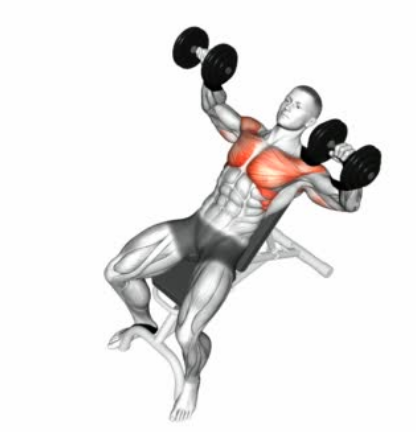

# Best exercises for each body part group with Videos
Website created by Antonio Joaquin Florendo 9 Brebeuf Group A

## Chest
Chest, one of the biggest muscles in the human body, one of its main functions is to push outward. In order to activate it and train it you must do exercises with a pushishing motion. 
### 1. Bench Press

The bench press is one the most common and also one of the simplest chest exercise you can do, even though it is simple it is still very effective for activating your chest, even pro body builders still use this exercise. In order to do the bench press you must find a bar(if you can't find a bar use a dumbell) lay down on the bench with your chest out and back not touching the bench, raise the bar over your chest with your hands and arms shoulder width apart. Slowly put the bar on to the lower part of your chest then push the bar up. Note that when you are dong this exercise you must have proper breathing so that you won't run out of breath. When holding the bar breathe in, then hold your breath when bringing the bar down then breathe out when bring the bar up. 
### 2. Inclined Dumbell Press

The inclined press is also a very common and simple chest exercise in which you activate your upper pectoralis major or upper chest. It is done by laying on an inclined bench with a similar motion done while doing the bench press. While laying on an inclined bench with your chest out and lower back not touching the bench hold the bar over your chest, slowly bring it down to your lower chest, after that slowly raise the bar or dumbell over your chest. Note that when you are dong this exercise you must have proper breathing so that you won't run out of breath. When holding the bar breathe in, then hold your breath when bringing the bar down then breathe out when bring the bar up. 

[SirGain's Website Link](https://641n.github.io/)

